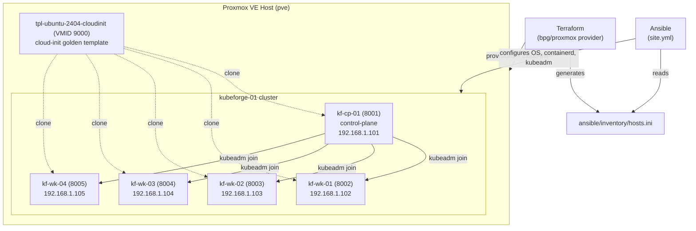

# KubeForge Architecture

**Flow:** Terraform clones the cloud-init template into 5 VMs, injects SSH keys/network/hostname via cloud-init, and writes the Ansible inventory. Ansible then installs containerd + kubeadm on all nodes, runs `kubeadm init` + Calico on `kf-cp-01`, and joins the four `kf-wk-*` workers.
